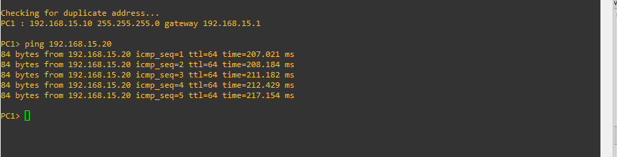

# Practica 1.

## Integrantes

| Carné | Nombres |
| ------------- | ------------- |
| 201905837  | Ariel Rubelce Macario Coronado  |
| 201908321  | Katerine Adalinda Santos Ramirez  |
| 201908335  | Oscar Rene Rodriguez Vasquez   |
| 201612185  | Byron Antonio Alvarez Morales   |

# 201908321

## Configuraciones VPC'S

- VPC 201908321

## Pings Entre Usuarios

- Pings 201905837

### 201908321

- Pings 201908335

- Pings 201612185

### 201905837

- Pings 201908321

- Pings 201908335

- Pings 201612185

## Configuraciones Cloudas

### 201908321

- Clouds 201905837

- Clouds 201908335

- Clouds 201612185
 

### 201905837

- Clouds 201908321

- Clouds 201908335

- Clouds 201612185

