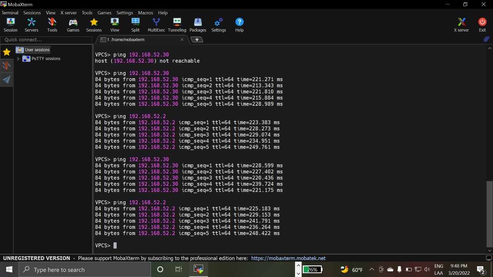
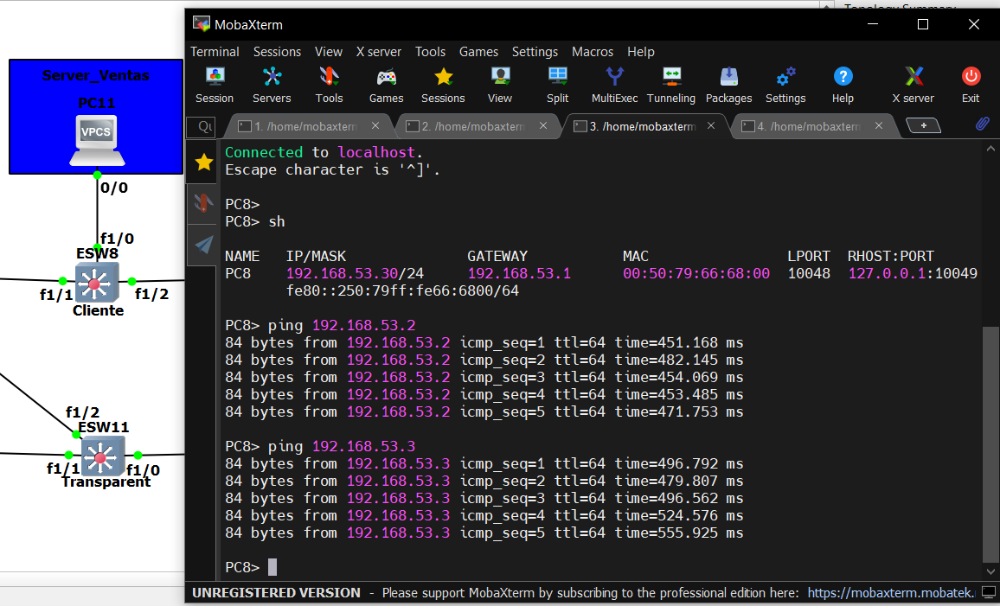

<h1 align="center" style="font-size: 40px; font-weight: bold;">Proyecto 2</h1>
<h3 align="center" style="font-size: 20px; font-weight: bold;">Manual Técnico</h3>

<br>
<br>

<center>

## Integrantes

| Carné     | Nombres                          |
| --------- | -------------------------------- |
| 201905837 | Ariel Rubelce Macario Coronado   |
| 201908321 | Katerine Adalinda Santos Ramirez |
| 201908335 | Oscar Rene Rodriguez Vasquez     |
| 201612185 | Byron Antonio Alvarez Morales    |

</center>

## Tabla de Contenido

- [**1. Introduccion**](#1-introduccion)
- [**2. Requisitos del Sistema**](#2-requisitos-del-sistema)
- [**3. Detalle de Computadoras**](#3-detalle-de-computadoras)
- [**4. Comandos Generales**](#4-comandos-generales)
- [**5. Configuración**](#5-configuración)
- [**6. Resultados**](#6-resultados)

<br>

# **1. Introduccion**

Uno de los recursos mas valiosos a lo largo de todo el munod hoy en dia es la informacion, los datos. En una epoca donde todo funciona y se obtiene a traves de datos es logico pensar que es un campo de estudio
Obviamente para un ingeniero en sistemas no es la excepcion saber utilizar herramientas que producen un gran numero de resultados sino tambien saber analizarlos e interpretalos para obtener su mayor provecho en todos los campos que abarca esta ciencia.

<br><br>

# **2. Requisitos del Sistema**

| Componente        | Mínimo                                                                                                              | Recomendado                                                                                                         |
| ----------------- | ------------------------------------------------------------------------------------------------------------------- | ------------------------------------------------------------------------------------------------------------------- |
| Sistema Operativo | Windows 7 (64 bit) or superior                                                                                      | Windows 7 (64 bit) or superior                                                                                      |
| Procesador        | 2 o mas núcleos lógicos                                                                                             | 4 o mas núcleos lógicos – AMD-V / RVI Series or Intel VT-X / EPT                                                    |
| Memoria           | 4 GB RAM                                                                                                            | 16 GB de RAM o más                                                                                                  |
| Disco Duro        | 1GB de espacio disponible (la instalación es < 200MB)                                                               | Disco de estado sólido con 35 GB de espacio disponilbe                                                              |
| Virtualización    | Se requieren extensiones de virtualización. Es posible que deba habilitar esto a través del BIOS de su computadora. | Se requieren extensiones de virtualización. Es posible que deba habilitar esto a través del BIOS de su computadora. |

<br><br>

# **3. Detalle de Computadoras**

A continuación se describen las especificaciones de cada una de las máquinas fisicas donde se desarrollaron cada una de las partes de la topología del proyecto 1. Estas consisten en la version de GNS3 que se utilizo aso como el sistema operativo donde se trabajó.

## Topologia 1 - Ariel Rubelce Macario Coronado

<br>

<p align="center">
  
</p>
<p align="center">
  
</p>

## Topologia 2 - Katerine Adalinda Santos Ramirez

<br>

<p align="center">
  
</p>
<p align="center">
  
</p>

## Topologia 3 - Oscar Rene Rodriguez Vasquez

<br>

<p align="center">
  
</p>
<p align="center">
  
</p>

Para las 3 configuraciones de las topologias se utilizó la misma imagen IOS para los switch de capa 3 empleados y configurados. Los switches representados contienen el siguiente detalle

  <p align="center">
  
  
  </p>
  <p align="center">
  
  
  </p>

<br><br>

# **4. Comandos Generales**

## Conexiones

```cmd
config t
int 'número de interfaz ej.f1/1'
switchport mode trunk
switchport trunk allowed vlan 1,10,20,30,40,1002-1005
switchport access vlan 'número de vlan ej.10'
exit

```

## Server

```cmd
vtp domain Grupo5
vtp password Grupo5
vtp mode server
vtp version 2

```

## Cliente

```cmd
vtp domain Grupo5
vtp password Grupo5
vtp mode client
vtp version 2

```

## Transparente

```cmd
vtp domain Grupo5
vtp password Grupo5
vtp mode server
vtp pruning
vtp transparent

```

## Show

```cmd
do sh vlan-sw
sh vtp st
sh interfaces trunk

```

<br><br>

# **5. Configuración**

En esta sección se describirá las configuraciones que se realizaron a cada una de las partes de la topología para su correcto funcionamiento.

## Topología 1

Se pueden observar todos los usuarios finales tienen conexion especifica en la red. La configuracion principal realizada para el switch 'ESW1' fue definir cada uno de sus puertos correctamente con los comandos de [conexión](#conexiones) para definir un modo de acceso truncal entre la cloud y los otros dos switches y asi permitiendo las vlans creadas en la topologia 2.

<p align="center">
  
</p>

Podemos observar en la siguiente imagen como los puertos del switch 'ESW1' estan configurados adecuadamente de manera truncal y las vlans especificas para cada uno de estos ya que los otros dos switch no necesitaban las mismas o todas las vlans en cada uno de ellos.

<p align="center">
  
</p>

En la siguiente imagen podemos observar de manera mas detallada el nombre y número de las vlans que adquiere el switch 'ESW1' de su conexion cloud y de la configuracion realizada en la otra topología.

<p align="center">
  
</p>

Tambien se configuró el vtp del switch 'ESW1' con los comandos de [cliente](#cliente) descritos en la sección anterior para la correcta propragacion de las vlans ya configuradas.
En la siguiente imagen se muestran los resultados de ejecutar los comandos correspondientes y las nuevas configuraciones del switch.

<p align="center">
  
</p>

## Topología 2

Permite la conexion del área final de trabajo con los servidores que se poseen. La configuracion de servidor se realizó para el switch 'ESW1 donde se programo tando los comandos de [conexión](#conexiones) para todos los peurtos como el de [vtp](#server) para definir su modo servidor.

<p align="center">
  
</p>
Se pueden observar los modos de acceso de cada unos de los puertos del servidor.
<p align="center">
  
</p>

En este switch se generan cada una de las vlans solicitadas con sus direcciones especificas que se muestran en la siguiente imagen.

<p align="center">
  
</p>

En la siguiente imagen se observa el resultado de la configuracion medianto los comandos para el switch de modo server y con el nombre respectivo.

<p align="center">
  
</p>

## Topología 3

EN esta topologia se configuran los switch que estan del lado de los servidores para su correcto funcionamiento.

<p align="center">
  
</p>

Se configuran las interfaces adecuadamente con los comandos de [conexión](#conexiones) ademas de la configuración vtp transparente para los switches en especifico con el comando [vtp](#transparente) especifico como se detalla en la seccion de comandos.
Podemos observar en la imagen la configuracion de los switches de vtp transparente junto con los puertos especificos y los numeros de las vlans con acceso truncal.

<p align="center">
  
</p>

Y en la siguiente imagen se corroboran las vlans replicadas como todos los switches anteriores.

<p align="center">
  
</p>

# **6. Resultados**

## Topología 1

<br>
<p align="center">
  
  
</p>
<p align="center">
  
  
</p>
<p align="center">
  
  
</p>
<p align="center">
  
  
</p>

## Topología 2

<br>
<p align="center">
  
</p>

## Topología 3

<br>
<p align="center">
  
  
</p>
<p align="center">
  
  
</p>
