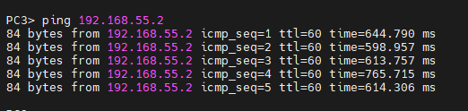
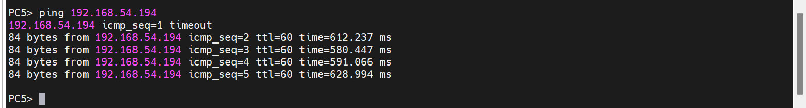
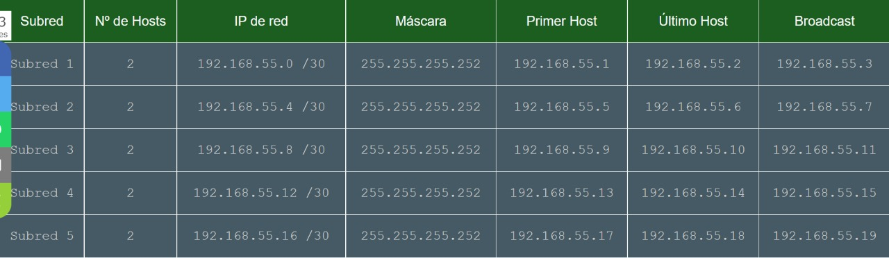

<h1 align="center" style="font-size: 40px; font-weight: bold;">Proyecto 2</h1>
<h3 align="center" style="font-size: 20px; font-weight: bold;">Manual Técnico</h3>

<br>
<br>

<center>

## Integrantes

| Carné     | Nombres                          |
| --------- | -------------------------------- |
| 201905837 | Ariel Rubelce Macario Coronado   |
| 201908321 | Katerine Adalinda Santos Ramirez |
| 201908335 | Oscar Rene Rodriguez Vasquez     |
| 201612185 | Byron Antonio Alvarez Morales    |

</center>

## Tabla de Contenido

- [**1. Introduccion**](#1-introduccion)
- [**2. Requisitos del Sistema**](#2-requisitos-del-sistema)
- [**3. Topologia 1**](#3-topologia-1)
- [**4. topologia 2**](#4-topologia-2)
- [**5. Topologia 3**](#5-topologia-3)
- [**6. Resultados**](#6-resultados)
- [**7. Subnetting**](#7-subnetting)

<br>

# **1. Introduccion**

Uno de los recursos mas valiosos a lo largo de todo el munod hoy en dia es la informacion, los datos. En una epoca donde todo funciona y se obtiene a traves de datos es logico pensar que es un campo de estudio
Obviamente para un ingeniero en sistemas no es la excepcion saber utilizar herramientas que producen un gran numero de resultados sino tambien saber analizarlos e interpretalos para obtener su mayor provecho en todos los campos que abarca esta ciencia. Aplicando todos los conocimientos de redes se llevara a cabo el proyecto simulando y utilizando distintas condiguraciones para un aprendizaje completo.

<br><br>

# **2. Requisitos del Sistema**

| Componente        | Mínimo                                                                                                              | Recomendado                                                                                                         |
| ----------------- | ------------------------------------------------------------------------------------------------------------------- | ------------------------------------------------------------------------------------------------------------------- |
| Sistema Operativo | Windows 7 (64 bit) or superior                                                                                      | Windows 7 (64 bit) or superior                                                                                      |
| Procesador        | 2 o mas núcleos lógicos                                                                                             | 4 o mas núcleos lógicos – AMD-V / RVI Series or Intel VT-X / EPT                                                    |
| Memoria           | 4 GB RAM                                                                                                            | 16 GB de RAM o más                                                                                                  |
| Disco Duro        | 1GB de espacio disponible (la instalación es < 200MB)                                                               | Disco de estado sólido con 35 GB de espacio disponilbe                                                              |
| Virtualización    | Se requieren extensiones de virtualización. Es posible que deba habilitar esto a través del BIOS de su computadora. | Se requieren extensiones de virtualización. Es posible que deba habilitar esto a través del BIOS de su computadora. |

<br><br>

# **3. Topologia 1**

<p align="center">
  
</p>
<br>

## Configuración Switch

<br>

<p align="center">
  
</p>
<br>

## Configuración de Routers

- Router2

```c
conf t
int f1/0
ip address 10.5.0.27 255.255.255.248
no shutdown
exit
int f0/0
ip address 10.5.0.34 255.255.255.248
no shutdown
exit
```

- Router3

```c
conf t
int f1/0
ip address 10.5.0.3 255.255.255.248
no shutdown
exit
int f0/0
ip address 10.5.0.10 255.255.255.248
no shutdown
exit
```

- Router4

```c
conf t
int f1/0
ip address 10.5.0.18 255.255.255.248
no shutdown
exit
int f0/0
ip address 10.5.0.11 255.255.255.248
no shutdown
exit
```

- Router5

```c
conf t
int f1/0
ip address 10.5.0.42 255.255.255.248
no shutdown
exit
int f0/0
ip address 10.5.0.35 255.255.255.248
no shutdown
exit
```

## Configuración de Rutas Estáticas

- Router2

```c
ip route 192.168.54.0 255.255.255.0 10.5.0.26
ip route 10.5.0.40 255.255.255.248 10.5.0.35
ip route 192.168.55.0 255.255.255.0 10.5.0.35
end
```

- Router3

```c
ip route 192.168.54.0 255.255.255.0 10.5.0.2
ip route 10.5.0.16 255.255.255.248 10.5.0.11
ip route 192.168.55.0 255.255.255.0 10.5.0.11
end
```

- Router4

```c
ip route 192.168.55.0 255.255.255.0 10.5.0.19
ip route 10.5.0.0 255.255.255.248 10.5.0.10
ip route 192.168.54.0 255.255.255.0 10.5.0.10
end
```

- Router5

```c
ip route 192.168.55.0 255.255.255.0 10.5.0.43
ip route 10.5.0.24 255.255.255.248 10.5.0.34
ip route 192.168.54.0 255.255.255.0 10.5.0.34
end

```

## Configuración GLBP y HSRP

- Router2

```c
conf t
int f0/0
Glbp 1 ip 10.5.0.35
Glbp 1 priority 100
Glbp 1 preempt
Glbp 1 load-balancing Round Robin
end
```

- Router3

```c
conf t
int f0/0
Glbp 1 ip 10.5.0.11
Glbp 1 priority 100
Glbp 1 preempt
Glbp 1 load-balancing Round Robin
end
```

- Router4

```c
conf t
int f0/0
standby 1 ip 10.5.0.10
standby 1 priority 150
standby 1 preempt
end
```

- Router5

```c
conf t
int f0/0
standby 1 ip 10.5.0.34
end

```

- Observar Protocolos

```c
sh glbp
sh glbp brief

sh standby
sh standby brief
```

# **4. Topologia 2**

## Creación VLANS

ESW1

```c
config terminal

vlan 10
name RHUMANOS
exit

vlan 20
name CONTABILIDAD
exit

vlan 30
name VENTAS
exit

vlan 40
name INFORMATICA
exit
```

## Configuración de Interfaces

ESW1

```c
config terminal

interface f2/3
switchport mode truck
switchport trunk allowen vlan 1,10,20,30,40,1002-1005
exit

interface f2/2
switchport mode truck
switchport trunk allowen vlan 1,20,30,1002-1005
exit

interface f2/1
switchport mode truck
switchport trunk allowen vlan 1,10,40,1002-1005
exit
```

## Router on Stick

```c
config terminal
interface f1/0
no sh
exit
interface f1/0.10
encap do1q 10
ip add 192.168.54.193 255.255.255.224
exit
interface f1/0.20
encap do1q 20
ip add 192.168.54.225 255.255.255.240
exit
interface f1/0.30
encap do1q 30
ip add 192.168.54.1 255.255.255.128
exit
interface f1/0.40
encap do1q 40
ip add 192.168.54.129 255.255.255.192
exit
```

## Configuración VPCs

```c
VENTAS
ip 192.168.54.2/25 192.168.54.1
save
CONTABILIDAD
ip 192.168.54.226/28 192.168.54.226
save
RRHH
ip 192.168.54.194/27 192.168.54.194
INFORMATICA
save
ip 192.168.54.130/26 192.168.54.129
save
```

## Configuración de Rutas Estáticas

```c
ip route 10.5.0.8 255.255.248 10.5.0.3
ip route 10.5.0.32 255.255.248 10.5.0.27
ip route 10.5.0.16 255.255.248 10.5.0.3
ip route 10.5.0.40 255.255.248 10.5.0.27
ip route 192.168.55.0 255.255.248 10.5.0.3
ip route 192.168.55.0 255.255.248 10.5.0.27
```

<br>

# **5. Topologia 3**

<p align="center">
  
</p>
<br>

## Creación VLANS

ESW2

```c
configure terminal
vlan 10
name RHUMANOS
exit

vlan 20
name CONTABILIDAD
exit

vlan 30
name VENTAS
exit

vlan 40
name INFORMATICA
exit
```

## Configuración de Interfaces

ESW2

```c
configure terminal

int f2/0
switchport mode trunk
switchport trunk allowed vlan 1,10,20,30,40,1002-1005
no shutdown
exit

int f2/1
switchport mode access
switchport access vlan 10
no shutdown
exit

int f2/2
switchport mode access
switchport access vlan 20
no shutdown
exit

int f2/3
switchport mode access
switchport access vlan 30
no shutdown
exit

int f2/4
switchport mode access
switchport access vlan 40
no shutdown
exit
```

## Configuración de InterVLANs

```c
configure terminal
int f0/0
no shutdown
exit

int f0/0.10
encapsulation dot1Q 10
ip address 192.168.55.1 255.255.255.252
no shutdown
exit

int f0/0.20
encapsulation dot1Q 20
ip address 192.168.55.5 255.255.255.252
no shutdown
exit

int f0/0.30
encapsulation dot1Q 30
ip address 192.168.55.9 255.255.255.252
no shutdown
exit

int f0/0.40
encapsulation dot1Q 40
ip address 192.168.55.13 255.255.255.252
no shutdown
exit
```

## Configuración VPCs

```c
RRHH
ip 192.168.55.2 255.255.255.252 192.168.55.1
save
CONTABILIDAD
ip 192.168.55.6 255.255.255.252 192.168.55.5
save
VENTAS
ip 192.168.55.10 255.255.255.252 192.168.55.9
INFORMATICA
save
ip 192.168.55.14 255.255.255.252 192.168.55.13
save
```

## Configuración de Rutas Estáticas

```c
ip address 10.5.0.19 255.255.255.248
no shutdown
ip address 10.5.0.43 255.255.255.248
no shutdown

ip route 10.5.0.8 255.255.255.248 10.5.0.18
ip route 10.5.0.0 255.255.255.248 10.5.0.18
ip route 10.5.0.32 255.255.255.248 10.5.0.42
ip route 10.5.0.24 255.255.255.248 10.5.0.42
ip route 192.168.54.0 255.255.255.0 10.5.0.42
ip route 192.168.54.0 255.255.255.0 10.5.0.18
```

<br>

# **6. Resultados**

## Topologia 1

### Ping de Routers

- Router1

<p align="center">
  
</p>

- Router2

<p align="center">
  
</p>

- Router3

<p align="center">
  
</p>

- Router4

<p align="center">
   
</p>

## Interfaces

- Router2
<p align="center">
  
</p>

- Router3

<p align="center">
  
</p>

- Router4

<p align="center">
  
</p>

- Router5

<p align="center">
  
</p>

<br>

## Topologia 2

### Pings

- Recursos Humanos

<p align="center">
   
</p>

- Ventas

<p align="center">
   
</p>

- Informatica

<p align="center">
   
</p>

- Contabilidad

<p align="center">
   
</p>

- Router

<p align="center">
   
</p>

### VLANs

- Cliente

<p align="center">
   
</p>

### Interfaces

<p align="center">
   
</p>

## Topologia 3

### Pings

- Recursos Humanos

<p align="center">
   
</p>

- Ventas

<p align="center">
   
</p>

- Informatica

<p align="center">
   
</p>

- Contabilidad

<p align="center">
   
</p>

### VLANs

- Cliente

<p align="center">
   
</p>

### Interfaces

<p align="center">
   
</p>

<br>

# **7. Subnetting**

## Tabla de Subnetting

### Topologia 2

<p align="center">
  
</p>

| VLAN              | Salto | Network            | Mask            | P. Asignable   | U. Asignable   | Broadcast      | # Hosts | Host totales |
| ----------------- | ----- | ------------------ | --------------- | -------------- | -------------- | -------------- | ------- | ------------ |
| 30 - Ventas       | Salto | 192.168.54.0 /25   | 255.255.255.128 | 192.168.54.1   | 192.168.54.126 | 192.168.54.127 | 126     |
| 40 - Informatica  | Salto | 192.168.54.128 /26 | 255.255.255.192 | 192.168.54.129 | 192.168.54.190 | 192.168.54.191 | 62      |
| 10 - RHumanos     | Salto | 192.168.54.192 /27 | 255.255.255.224 | 192.168.54.193 | 192.168.54.222 | 192.168.54.223 | 30      |
| 20 - Contabilidad | Salto | 192.168.54.224 /28 | 255.255.255.240 | 192.168.54.225 | 192.168.54.238 | 192.168.54.239 | 14      |

### Topologia 3

<p align="center">
  
</p>

| VLAN              | Salto | Network            | Mask            | P. Asignable  | U. Asignable  | Broadcast     | # Hosts | Host totales |
| ----------------- | ----- | ------------------ | --------------- | ------------- | ------------- | ------------- | ------- | ------------ |
| 10 - RHumanos     | Salto | 192.168.55.0 /30   | 255.255.255.252 | 192.168.54.1  | 192.168.55.2  | 192.168.55.3  | 2       |
| 20 - Contabilidad | Salto | 192.168.55.4 /30   | 255.255.255.252 | 192.168.55.5  | 192.168.55.6  | 192.168.55.7  | 2       |
| 30 - Ventas       | Salto | 192.168.55.8 /30   | 255.255.255.252 | 192.168.55.9  | 192.168.55.10 | 192.168.55.11 | 2       |
| 40 - Informatica  | Salto | 1192.168.55.12 /30 | 255.255.255.252 | 192.168.55.13 | 192.168.55.18 | 192.168.55.15 | 2       |
